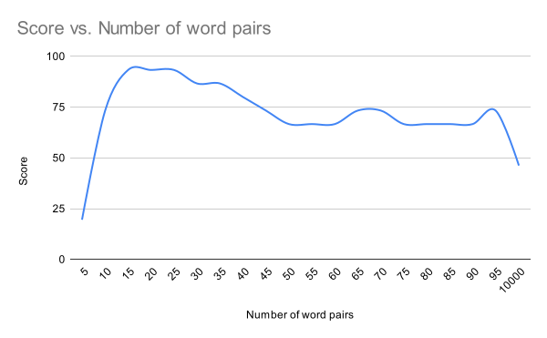

# LitAI Markov Midterm Taker

## Overview
This is my final project for Professor Dennis Tenen's [Literature in the Age of Artificial Intelligence](https://github.com/denten-courses/LITAI/tree/master/2022) class, which I took in the spring of 2022.

For the midterm, students received a list of passages from texts we'd read throughout the semester, and we had to identify their sources. For this project, I've created a program that uses Markov chains to take the midterm.

Of course, a better approach would be to merely search for the passage in each source text. The goal of this project is not to produce the best possible test-taker but to learn about Markov chains and their applications and--if we're lucky--uncover some hidden Markov chain behavior.

The program works by constructing Markov chains out of the given [passages](./passages.go) and [source texts](./texts) and matching them based on their similarity. The most interesting part of this program is the scoring function, `getChainSimilarityScore`, that determines how similar two Markov chains are.

## How scoring works

`getChainSimilarityScore` takes two Markov chains in the form of maps and returns a "similarity score" in the range [0, 1]. Here are two example sentences and their corresponding chains:

"That _fish_ ate that fish."
```json
{
  "ate": {
    "that": 1
  },
  "fish": {
    "ate": 1
  },
  "that": {
    "fish": 2
  }
}
```

"That _cat_ ate that fish."
```json
{
  "ate": {
    "that": 1
  },
  "cat": {
    "ate": 1
  },
  "that": {
    "cat": 1,
    "fish": 1
  }
}
```

Next, it creates a sub-score for every pair of consecutive words (e.g., "that fish") in each chain. For example, in the first chain, the word pair "that fish" appears twice, but in the second chain, it only appears once. The sub-score is calculated by diving the smaller number by the larger number. Thus, the score for the word pair "that fish" is 1/2, or 0.5.

I believe that a word pair that appears _more_ frequently should have a greater impact on the overall score than a word pair that appears _less_ frequently. Thus, the function weights these sub-scores according to the number of times they appear. For example, "that fish" appears three times across both chains, so its weight is three. That is, the sub-score of 0.5 will be factored in the overall score three times.

The function supports different mathematical "strategies" for aggregating these sub-scores into the overall score: mean, median, and mode. In my testing, the mean strategy has proven most effective.

The function also allows the user to specify the number of top word pairs to include in the calculation. For example, the top word pair in the first chain above is "that fish" because it appears twice. In my testing, I have found that setting this parameter to a relatively low number improves scoring accuracy.

## Running the program
The program can be run by executing `go run .` in the root directory. When run, the program performs a Monte Carlo simulation in which it takes the midterm repeatedly using different values for `options.topWordPairs`. It records the results in [output.txt](./output.txt).

## Planning and development

I ended up completing the first idea described in my [proposal](./proposal.md), which was to create a midterm-taking program based on Markov chains and then run a Monte Carlo simulation to tune its parameters. When I began, I wasn't sure which parameters I'd build into the program. I began by adding "strategies" (mean, median, and mode) on the hunch that some hidden grammatical patterns could be better exposed by different mathematical functions. Taking the mean of a set of sub-scores makes intuitive sense, but I wondered if the median and mode might prove successful for non-obvious reasons. For example, consider a pair of significantly differentiated texts that contain a lot of generic word pairs (e.g., "I think" or "it is"). The scoring algorithm would do well to find a way to ignore these pairs even if they appear frequently in both texts. Taking the median sub-score would be one such method for filtering out this noise.

During the development process, I evaluated the strategies by running a Monte Carlo simulation and found that the mean strategy was hands-down the most effective. I was expecting as much, but I was disappointed that the mode and median strategies proved virtually worthless. If I had more time, I would have liked to create pairs of sample texts for which the mode and median strategies would outperform the mean one, and perhaps find a way to combine the strategies together. For example, we could take the mean, median, and mode and then take _their_ mean. However, with each step of aggregation we get one step further removed from the underlying Markov chain. This realization in itself helps explain why taking the mean is so much more accurate than taking the mode or median--it more directly represents the sub-scores.

One parameter I didn't plan to incorporate was "top word pairs" (TWP). This idea came out of an early test run in which I noticed that the scoring algorithm was suffering from what one might call "dilution." Even if two texts had many word pairs in common, those word pairs would represent only a small fraction of the total number of word pairs. The program was therefore pairing shorter texts with each other because shorter texts suffer less from dilution. For example, the program thought that almost every passage came from Kuhlmann's "Love-Kiss XLI" because that was the shortest source text. Setting a low TWP reduces the problem of dilution by focusing on the most frequently shared word pairs.

## Results

When using the mean strategy and a low TWP, the program proved to be an effective test-taker. The chart below shows the relationship between TWP and the program's test score:



The TWP sweet spot for this set of texts is in the 15-25 range (scoring 93%), although every TWP between 10 and 95 yields a passing (greater than 65%) grade. A TWP of 10,000 (the highest TWP allowed) yields a score of only 47%, which shows how important this parameter is to the program's accuracy.

Impressively, when using a TPM of 25, the program misidentified only one passage:

```json
{
  "incorrect_guesses": [
    {
      "actual": {
        "author": "Gottfried Leibniz",
        "title": "On the Combinatorial Art"
      },
      "guess": {
        "author": "Gottfried Leibniz",
        "title": "Philosophical Papers and Letters"
      }
    }
  ],
  "num_word_pairs": "25",
  "score": "93.33"
},
```

In fact, its only mistake was attributing a passage from one Leibniz text to another Leibniz text. Students taking the midterm were only required to identify the passage's author and not the name of its source text, which means that this particular run would have gotten a 100% on the midterm. This far exceeded my hopes, which were merely that my program would do better than random.

## Reflection

This semester we discussed two opposing schools of thought: functionalism and essentialism. It is interesting to consider these philosophies with respect to my program. From a functionalist perspective, the program exhibits intelligence. Without understanding the authors' arguments or even what any word means, it aces a test designed for Columbia students.

It is harder to make the "intelligence" argument from an essentialist perspective. What, if anything, constitutes the essence of the program? It is the product of Markov's lecture, my own observations, some basic math, and experimentation. However, it does appear to rely on some essential idea, which is that Markov chains provide a method for reducing a text into a quantifiable representation of its key characteristics. That said, an essentialist would likely argue that because the program is merely an automaton and not a living thing, it has no essence and therefore cannot possess intelligence. Essence has to be inherent--it cannot be programmed.

## Future improvements

If I were to continue working on this project, I'd begin by expanding its scope. Having conquered the midterm, I'd like to run the program on a much larger corpus to see if it could determine authorship. That is, could it group a large set of texts by their authors? One challenge is that if authors write about significantly different topics, they may not have many word pairs in common. Conversely, if two different authors write about the same topic, they may have many word pairs in common even if they write differently. This gives rise to questions about what exactly the Markov chain approach identifies. Is it style or content? If we wanted to focus on style instead of content, one approach would be to construct Markov chains out of the parts of speech (e.g., noun, adjective, etc.) instead of the words themselves. A sentence diagramming tool like [this one](https://www.link.cs.cmu.edu/cgi-bin/link/construct-page-4.cgi) could prove helpful.

It would be fun to see if this program can suss out relationships between authors. For example, we could run it on two sets of texts: texts by authors who influenced each other, and texts by authors working out of different traditions. We would need to control for changes in diction over the years, as some words go in and out of fashion. Google's [ngram tool](https://books.google.com/ngrams) could be useful here.

There are some smaller changes I would also like to make. Right now TWP is hard-coded, but it would probably make more sense for it to be a function or percentage of the size of the Markov chain.

Likewise, to reduce noise, I would consider pruning the most universally common word pairs (e.g., "it is") from Markov chains before scoring them. We could find these word pairs by running the scoring function on a chain made from a large corpus.

I would like to experiment with groups of words rather than merely word pairs, as well as groups of characters. These numbers could be incorporated into the program as parameters.

Unfortunately, I was unable to upload a copy of Wilkins' "An Essay Towards a Real Character, and a Philosophical Language" because my PDF-to-text converter failed to convert it, so my program's 100% midterm score comes with a caveat. Two midterm passages were from the Wilkins and I had to exclude them from the simulation.

Additionally, my PDF-to-text converter was not perfect. There are typos all over the place in my source text files. These files also contain irrelevant paratexts such as authors' introductions and translators' notes, although I've done my best to remove them where convenient.

Last, I would like to make the output tell the user which word pairs ended up contributing to the program's guess. For example, if a TWP of 10 was selected, then the output should show a ranked list of 10 word pairs with their corresponding scores. With the way I designed my program, it would require a significant redesign to make this happen.

## Acknowledgements and closing thoughts

Thanks to Professor Tenen and Beah Jacobson for your help with brainstorming and for letting me do this in the first place. This was loads of fun to work on. You know a project is going well if you work on it for eight hours in a row by choice.

Anyone is free to build on, imitate, mock, or disparage this project. You probably shouldn't use it to take the midterm or final for this class... but you could :)
